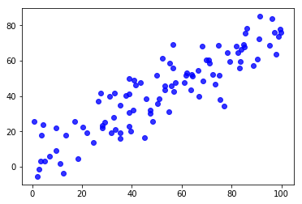
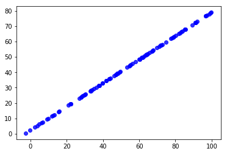
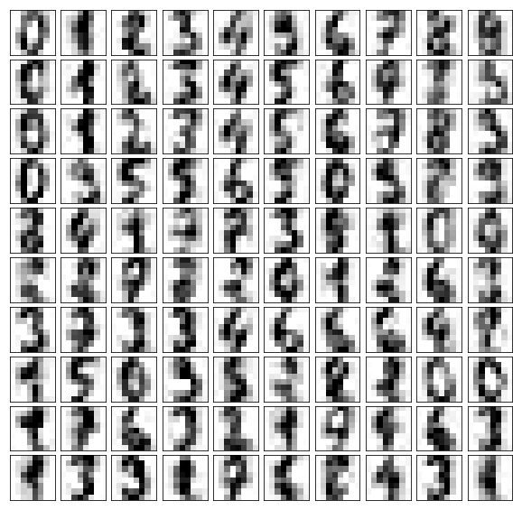

# 8.使用PCA对数据进行降噪


## 1.回忆我们之前的例子


```python
import numpy as np
import matplotlib.pyplot as plt
X = np.empty((100,2))
X[:,0] = np.random.uniform(0.,100.,size=100)
# 0.75倍的X[:,0]加上3加上一个噪音
X[:,1] = 0.75*X[:,0]+3.+np.random.normal(0.,10.,size=100)
plt.scatter(X[:,0],X[:,1],color='b',alpha=0.8)
```


    <matplotlib.collections.PathCollection at 0x10c31e828>





> 现在有一个问题：这个数据集展现出来这样的结果，可是是不是有这样一种情况，这个数据集就应该是一根直线呢
换句话说，这个数据集展现的是在一根直线上下进行抖动式的分布，实际上这种抖动和这根直线本身的距离是噪音
这个噪音的产生原因可能有很多，如测量人员的粗心，测量手段有问题等等原因，都会使得我们在现实世界中采集的数据
是有噪音的


```python
from sklearn.decomposition import PCA
pca = PCA(n_components=1)
pca.fit(X)
X_reduction = pca.transform(X)
X_restore = pca.inverse_transform(X_reduction)
plt.scatter(X_restore[:,0],X_restore[:,1],color='b',alpha=0.8)
```


    <matplotlib.collections.PathCollection at 0x1a1437ef60>





> 我们使用PCA进行降维然后在反转回原来的维度，经过这样一个操作，可以发现此时这个数据
就成为了一条直线，比较一下这两个图，我们可以说，经过这样的操作，我们将原有数据集的噪音
给消除了
当然，在实际情况下，我们不好说X_restore就是一点噪音都没有，也不好说原数据的所有的抖动全都是
噪音，所以我们还是倾向于说从X到X_restore丢失了一些信息，不过我们丢失的信息很有可能有很大的一部分
是噪音，这也解释了为什么我们在上一节降维处理以后，反而识别率提高了

#### 总结一句话就是：降低了维度，丢失了信息，同时也去除了一部分噪音

## 2.手写识别的例子


```python
from sklearn import datasets

digits = datasets.load_digits()
X,y = digits.data,digits.target
```


```python
noisy_digits = X + np.random.normal(0,4,size=X.shape)
```


```python
# 获得每个标记加了噪音的10个元素，一共10个标记，公100个元素
example_digits = noisy_digits[y==0,:][:10]
for num in range(1,10):
    X_num = noisy_digits[y==num,:][:10]
    example_digits = np.vstack([example_digits,X_num])
example_digits.shape
```


    (100, 64)


```python
# 画出带噪音的图像
def plot_digits(data):
    fig,axes = plt.subplots(10,10,figsize=(10,10),
                           subplot_kw={'xticks':[],'yticks':[]},
                            gridspec_kw=dict(hspace=0.1,wspace=0.1))
    for i,ax in enumerate(axes.flat):
        ax.imshow(data[i].reshape(8,8),
                  cmap='binary',
                  interpolation='nearest',
                  clim=(0,16))
                        
```


```python
plot_digits(example_digits)
```


#### 使用PCA降噪


```python
# 实际情况下，应该多试一些数字，找到最合适的数字
pca = PCA(0.5)
pca.fit(noisy_digits)
pca.n_components_
```


    12


```python
components = pca.transform(noisy_digits)
filtered_digits = pca.inverse_transform(components)
plot_digits(filtered_digits)
# 相比之前，数字清楚了很多，平滑了很多，说明使用PCA进行降噪是可行的
```




