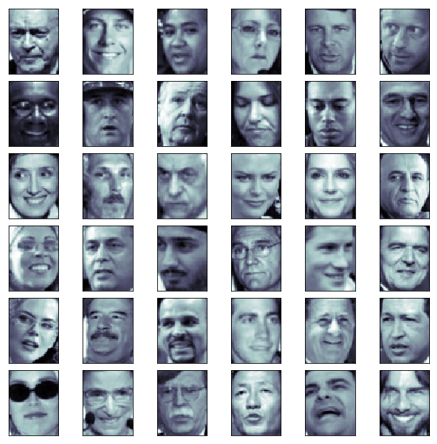
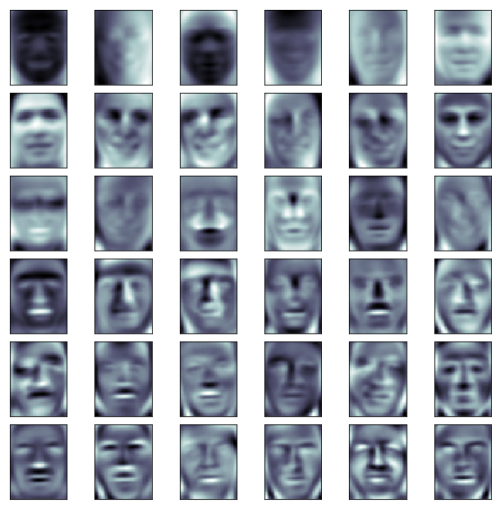

# 9.人脸识别与特征脸

##1.高维数据向低维数据映射


>对于W这个矩阵来说，每一行代表一个方向，第一行是最重要的方向，第二行是次重要的方向
如果将W中的每一行都看作一个样本的话，那么我们也可以说，第一行所代表的样本是最重要的那个样本，最能反应X这个矩阵原来的那个特征的样本
在人脸识别领域中，X的每一行都是人脸，而W中的每一行，相应的也可以理解为是一个人脸，就是特征脸。之所以叫特征脸就是因为，每一行都能反应原来的样本的一个重要的特征。
每一行实际上是一个主成分，他相当于表达了一部分原来的人脸数据中对应的一个特征


##2.实际编程用可视化的方式观察特征脸

### 1.加载人脸数据库


```python
import numpy as np
import matplotlib.pyplot as plt
from sklearn.datasets import fetch_lfw_people
```


```python
faces = fetch_lfw_people()
```

    Downloading LFW metadata: https://ndownloader.figshare.com/files/5976012
    Downloading LFW metadata: https://ndownloader.figshare.com/files/5976009
    Downloading LFW metadata: https://ndownloader.figshare.com/files/5976006
    Downloading LFW data (~200MB): https://ndownloader.figshare.com/files/5976015


```python
faces.data.shape
```


    (13233, 2914)


```python
# images是将我们的数据集以一个二维平面可视化的角度展现出来
# 62*47 = 2914
faces.images.shape
```


    (13233, 62, 47)


```python
# 随机获取36张脸
random_indexs = np.random.permutation(len(faces.data))
X = faces.data[random_indexs]
example_faces = X[:36,:]
example_faces.shape
```


    (36, 2914)


```python
def plot_digits(data):
    fig,axes = plt.subplots(6,6,figsize=(10,10),
                           subplot_kw={'xticks':[],'yticks':[]},
                            gridspec_kw=dict(hspace=0.1,wspace=0.1))
    for i,ax in enumerate(axes.flat):
        ax.imshow(data[i].reshape(62,47),cmap='bone')
plot_digits(example_faces)
```





```python
# 每张脸对应的人名
faces.target_names
```


    array(['AJ Cook', 'AJ Lamas', 'Aaron Eckhart', ..., 'Zumrati Juma',
           'Zurab Tsereteli', 'Zydrunas Ilgauskas'], dtype='<U35')


```python
# 说明一共包含5749个不同的人的脸
len(faces.target_names)
```


    5749


### 2.特征脸


```python
%%time
X,y = faces.data,faces.target
from sklearn.decomposition import PCA
# 使用随机的方式来求解出PCA
# 没有指定n_componets ，也就是说想求出所有的主成分
pca = PCA(svd_solver='randomized')
pca.fit(X)
```

    CPU times: user 1min 54s, sys: 2.73 s, total: 1min 57s
    Wall time: 30.8 s


```python
# 一共2914个维度，所以求出了2914个主成分
pca.components_.shape
```


    (2914, 2914)


#### 使用所有的主成分绘制特征脸，
> 可以看到排在前面的这些脸相应的比较笼统，排名第一的这张脸，告诉我们人脸大概就是这个位置，大概有这样一个轮廓
越往后，鼻子眼睛的信息就清晰了起来

通过求特征脸
- 一方面我们可以方便直观的看出在人脸识别的过程中我们是怎么看到每一张脸相应的特征的
- 另一方面，也可以看出来，其实每一张脸都是这些人脸的一个线性组合，而特征脸依据重要程度顺序的排在了这里


```python
plot_digits(pca.components_[:36])
```





由于fetch_lfw_people这个库的人脸是分布不均匀的，有的人可能只有一张图片，有的人有几十张
通过这个方法我们可以取出至少有60张脸的人的数据
```faces2 = fetch_lfw_people(min_faces_per_person=60)```


```python
X,y = faces2.data,faces2.target
```


