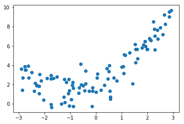
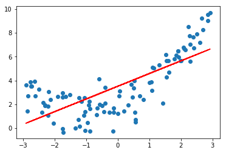
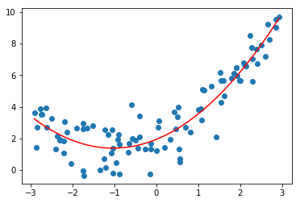

# 1.多项式回归简介
>考虑下面的数据，虽然我们可以使用线性回归来拟合这些数据，但是这些数据更像是一条二次曲线,相应的方程是**y=ax<sup>2</sup>+bx+c**,这是式子虽然可以理解为二次方程，但是我们呢可以从另外一个角度来理解这个式子：

>如果将x<sup>2</sup>理解为一个特征，将x理解为另外一个特征,换句话说，本来我们的样本只有一个特征x，现在我们把他看成有两个特征的一个数据集。多了一个特征x<sup>2</sup>，那么从这个角度来看，这个式子依旧是一个线性回归的式子，但是从x的角度来看，他就是一个二次的方程


以上这样的方式，就是所谓的多项式回归

相当于我们为样本多添加了一些特征，这些特征是原来样本的多项式项，增加了这些特征之后，我们们可以使用线性回归的思路更好的我们的数据


# 2.编程实验多项式回归


### 1.模拟多项式回归的数据集


```python
import numpy as np
import matplotlib.pyplot as plt

x = np.random.uniform(-3,3,size=100)
X = x.reshape(-1,1)
# 一元二次方程
y = 0.5*x**2 + x + 2+np.random.normal(0,1,size=100)

plt.scatter(x,y)
```


    <matplotlib.collections.PathCollection at 0x114f17160>





### 2.使用线性回归拟合
很明显，我们用一跟直线来拟合一根有弧度的曲线，效果是不好的


```python
from sklearn.linear_model import LinearRegression

lin_reg = LinearRegression()
lin_reg.fit(X,y)
y_predict = lin_reg.predict(X)

plt.scatter(x,y)
plt.plot(X,y_predict,color='r')
```


    [<matplotlib.lines.Line2D at 0x1a1c90ecf8>]





### 3.解决方案，添加一个特征
原来所有的数据都在X中，现在对X中每一个数据都进行平方，
再将得到的数据集与原数据集进行拼接，
在用新的数据集进行线性回归


```python
(X**2).shape
```


    (100, 1)


```python
X2 = np.hstack([X,X**2])
```


```python
lin_reg2 = LinearRegression()
lin_reg2.fit(X2,y)
y_predict2 = lin_reg2.predict(X2)

plt.scatter(x,y)
# 由于x是乱的，所以应该进行排序
plt.plot(np.sort(x),y_predict2[np.argsort(x)],color='r')
```


    [<matplotlib.lines.Line2D at 0x1a1c691198>]





从上图可以看出，当我们添加了一个特征（原来特征的平方）之后，再从x的维度来看，就形成了一条曲线，显然这个曲线对原来数据集的拟合程度是更好的


```python
# 第一个系数是x前面的系数，第二个系数是x平方前面的系数
lin_reg2.coef_
```


    array([1.08043759, 0.52423752])


```python
lin_reg2.intercept_
```


    1.9427736300237914
    

## 3.总结
多线性回归在机器学习算法上并没有新的地方，完全是使用线性回归的思路
他的关键在于为原来的样本，添加新的特征。而我们得到新的特征的方式是原有特征的多项式的组合。
采用这样的方式，我们就可以解决一些非线性的问题

与此同时需要主要，我们在上一章所讲的PCA是对我们的数据进行降维处理，而我们这一章所讲的多项式回归显然在做一件相反的事情，他让我们的数据升维，在升维之后使得我们的算法可以更好的拟合高纬度的数据


