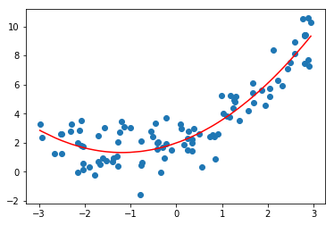

# 2.scikit-learn中的多项式回归于pipeline

## 1.使用scikit-learn中的多项式对数据进行预处理


```python
# sklearn中对数据进行预处理的函数都封装在preprocessing模块下，包括之前学的归一化StandardScaler
from sklearn.preprocessing import PolynomialFeatures

poly = PolynomialFeatures()
poly.fit(X)
X2 = poly.transform(X)
# 第一列是sklearn为我们添加的X的零次方的特征
# 第二列和原来的特征一样是X的一次方的特征
# 第三列是添加的X的二次方的特征
X2[:5]
```


    array([[ 1.        ,  2.5980174 ,  6.74969443],
           [ 1.        ,  2.07484052,  4.30496317],
           [ 1.        , -1.74999096,  3.06246837],
           [ 1.        , -2.74141103,  7.51533441],
           [ 1.        , -1.3420996 ,  1.80123135]])


## 2.调用LinearRegression对X2进行预测


```python

lin_reg2 = LinearRegression()
lin_reg2.fit(X2,y)
y_predict2 = lin_reg2.predict(X2)

plt.scatter(x,y)
# 由于x是乱的，所以应该进行排序
plt.plot(np.sort(x),y_predict2[np.argsort(x)],color='r')
```


    [<matplotlib.lines.Line2D at 0x1a1c4e8860>]


```python
lin_reg2.coef_
```


    array([0.        , 1.08043759, 0.52423752])


## 3.关于PolynomialFeatures


```python
# 测试多维的数据集
X = np.arange(1,11).reshape(5,2)
X.shape
```


    (5, 2)


```python
X
```


    array([[ 1,  2],
           [ 3,  4],
           [ 5,  6],
           [ 7,  8],
           [ 9, 10]])


```python
poly = PolynomialFeatures(degree=2)
poly.fit(X)
X2 = poly.transform(X)
X2
```


    array([[  1.,   1.,   2.,   1.,   2.,   4.],
           [  1.,   3.,   4.,   9.,  12.,  16.],
           [  1.,   5.,   6.,  25.,  30.,  36.],
           [  1.,   7.,   8.,  49.,  56.,  64.],
           [  1.,   9.,  10.,  81.,  90., 100.]])


将5*2的矩阵进行多项式转换后变成了5*6
- 第一列是1 对应的是0次幂
- 第二列和第三列对应的是原来的x矩阵，此时他有两列一次幂的项
- 第四列是原来数据的第一列平方的结果
- 第六列是原来数据的第二列平方的结果
- 第五列是原来数据的两列相乘的结果

可以想象如果将degree设置为3，那么将产生一下10个元素
   - 1,X<sub>1</sub>,X<sub>2</sub>
    
   - X<sup>2</sup><sub>1</sub>,X<sup>2</sup><sub>2</sub>,X<sub>1</sub>*X<sub>2</sub>
    
   - X<sub>1</sub><sup>3</sup>,X<sub>2</sub><sup>3</sup>,X<sub>1</sub><sup>2</sup>*X<sub>2</sub>,X<sub>2</sub><sup>2</sup>*X<sub>1</sub> 

也就是说PolynomialFeatures会穷举出所有的多项式组合


## 3.Pipline

pipline的英文名字是管道，那么 我们如何使用管道呢，先考虑我们多项式回归的过程

    1.使用```PolynomialFeatures```生成多项式特征的数据集
    2.如果生成数据幂特别的大，那么特征直接的差距就会很大，导致我们的搜索非常慢，这时候可以进行**数据归一化**
    3.进行线性回归
pipline 的作用就是把上面的三个步骤合并，使得我们不用一直重复这三步


```python
x = np.random.uniform(-3,3,size=100)
X = x.reshape(-1,1)
# 一元二次方程
y = 0.5*x**2 + x + 2+np.random.normal(0,1,size=100)
```


```python
from sklearn.preprocessing import PolynomialFeatures
from sklearn.preprocessing import StandardScaler
from sklearn.pipeline import Pipeline
# 传入每一步的对象名和类的实例化
poly_reg = Pipeline([
    ('poly',PolynomialFeatures(degree=2)),
    ('std_scaler',StandardScaler()),
    ('lin_reg',LinearRegression())
])
```


```python
poly_reg.fit(X,y)
y_predict = poly_reg.predict(X)
plt.scatter(x,y)
plt.plot(np.sort(x),y_predict[np.argsort(x)],color='r')
```


    [<matplotlib.lines.Line2D at 0x1a1ccc15c0>]




