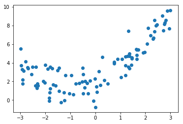
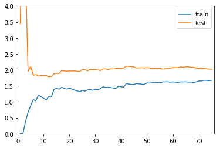
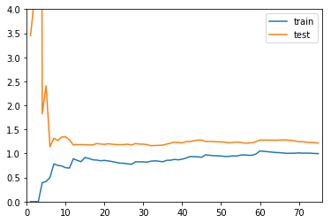

# 4.学习曲线


## 1. 什么是学习曲线

> 随着训练样本的主键增多，算法训练出的模型的表现能力


```python
import numpy as np
import matplotlib.pyplot as plt

np.random.seed(666)
x = np.random.uniform(-3,3,size=100)
X = x.reshape(-1,1)
y = 0.5 * x**2 + x + 2 + np.random.normal(0,1,size=100)

plt.scatter(x,y)
```


    <matplotlib.collections.PathCollection at 0x107369240>





## 2.实际编程实现学习曲线


```python
from sklearn.model_selection import train_test_split
X_train,X_test,y_train,y_test = train_test_split(X,y,random_state=10)
X_train.shape
```


    (75, 1)


#### 2.1观察线性回归的学习曲线：观察线性回归模型，随着训练数据集增加，性能的变化


```python
from sklearn.linear_model import LinearRegression
from sklearn.metrics import mean_squared_error

def plot_learning_curve(algo,X_train,X_test,y_train,y_test):
    
    train_score = []
    test_score = []

    # 计算学习曲线数据
    for i in range(1,len(X_train)+1):
        algo.fit(X_train[:i],y_train[:i])

        y_train_predict = algo.predict(X_train[:i])
        train_score.append(mean_squared_error(y_train[:i],y_train_predict))

        y_test_predict = algo.predict(X_test)
        test_score.append(mean_squared_error(y_test,y_test_predict))

    # 绘制学习曲线
    plt.plot([i for i in range(1,len(X_train)+1)],np.sqrt(train_score),label = 'train')
    plt.plot([i for i in range(1,len(X_train)+1)],np.sqrt(test_score),label = 'test')
    plt.axis([0,len(X_train)+1,0,4])
    plt.legend()

plot_learning_curve(LinearRegression(),X_train,X_test,y_train,y_test)
```





从趋势上看：
- 在训练数据集上，误差是逐渐升高的。这是因为我们的训练数据越来越多，我们的数据点越难得到全部的累积，不过整体而言，在刚开始的时候误差变化的比较快，后来就几乎不变了
- 在测试数据集上，在使用非常少的样本进行训练的时候，刚开始我们的测试误差非常的大，当训练样本大到一定程度以后，我们的测试误差就会逐渐减小，减小到一定程度后，也不会小太多，达到一种相对稳定的情况
- 在最终，测试误差和训练误差趋于相等，不过测试误差还是高于训练误差一些，这是因为，训练数据在数据非常多的情况下，可以将数据拟合的比较好，误差小一些，但是泛化到测试数据集的时候，还是有可能多一些误差

#### 2.2 观察多项式回归的学习曲线


```python
from sklearn.preprocessing import StandardScaler
from sklearn.preprocessing import PolynomialFeatures
from sklearn.pipeline import Pipeline

# 使用Pipline构建多项式回归模型
def PolynomialRegression(degree):
    return Pipeline([
        ("poly",PolynomialFeatures(degree=degree)),
        ("std_scaler",StandardScaler()),
        ("lin_reg",LinearRegression())
    ])

# 使用二阶多项式回归
poly2_reg = PolynomialRegression(2)
plot_learning_curve(poly2_reg,X_train,X_test,y_train,y_test)
```





首先整体从趋势上，和线性回归的学习曲线是类似的
仔细观察，和线性回归曲线的不同在于，线性回归的学习曲线1.5，1.8左右；2阶多项式回归稳定在了1.0，0.9左右,2阶多项式稳定的误差比较低，说明
使用二阶线性回归的性能是比较好的


```python
# 使用20阶多项式回归
poly20_reg = PolynomialRegression(20)
plot_learning_curve(poly20_reg,X_train,X_test,y_train,y_test)
```


在使用20阶多项式回归训练模型的时候可以发现，在数据量偏多的时候，我们的训练数据集拟合的是比较好的，但是测试数据集的误差相对来说增大了很多，离训练数据集比较远，通常这就是过拟合的结果，他的泛化能力是不够的

## 3.总结


对于欠拟合比最佳的情况趋于稳定的那个位置要高一些，说明无论对于训练数据集还是测试数据集来说，误差都比较大。这是因为我们本身模型选的就不对，所以即使在训练数据集上，他的误差也是大的，所以才会呈现出这样的一种形态


对于过拟合的情况，在训练数据集上，他的误差不大，和最佳的情况是差不多的，甚至在极端情况，如果degree取更高的话，那么训练数据集的误差会更低，但是问题在于，测试数据集的误差相对是比较大的，并且训练数据集的误差和测试数据集的误差相差比较大（表现在图上相差比较远），这就说明了此时我们的模型的泛化能力不够好，他的泛化能力是不够的
