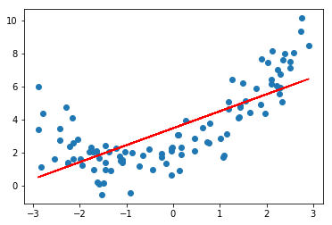
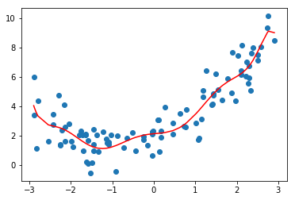
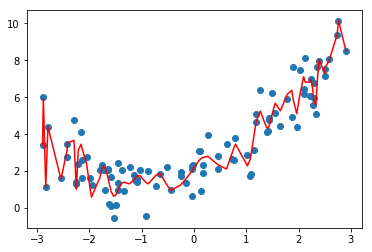
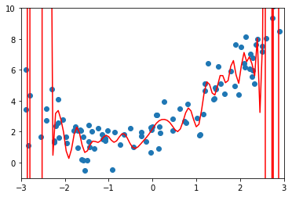

# 3.过拟合与前拟合

## 1.什么是过拟合和欠拟合


```python
import numpy as np
import matplotlib.pyplot as plt
from sklearn.linear_model import LinearRegression

x = np.random.uniform(-3,3,size=100)
X = x.reshape(-1,1)
y = 0.5*x**2 + x + 2+np.random.normal(0,1,size=100)

lin_reg = LinearRegression()
lin_reg.fit(X,y)
y_predict = lin_reg.predict(X)

plt.scatter(x,y)
plt.plot(X,y_predict,color='r')
```


    0.5406237455773699





```python
# 直接使用线性回归，显然分数太低
lin_reg.score(X,y)
```


    0.5406237455773699


> 使用均方误差来看拟合的结果，这是因为我们同样都是对一组数据进行拟合，所以使用不同的方法对数据进行拟合
得到的均方误差的指标是具有可比性的，（但是对于多项式回归来说，使用r<sup>2</sup>score进行衡量是没有问题是）


```python
from sklearn.metrics import mean_squared_error

y_predict = lin_reg.predict(X)
mean_squared_error(y,y_predict)
```


    2.6112077267395803


 #### 使用多项式回归


```python
from sklearn.preprocessing import PolynomialFeatures
from sklearn.preprocessing import StandardScaler
from sklearn.pipeline import Pipeline

# 使用Pipeline构建多项式回归
def PolynomialRegression(degree):
    poly_reg = Pipeline([
        ('poly',PolynomialFeatures(degree=degree)),
        ('std_scaler',StandardScaler()),
        ('lin_reg',LinearRegression())
    ])
    return poly_reg
poly_reg2 = PolynomialRegression(2)
poly_reg2.fit(X,y)
y2_predict = poly_reg2.predict(X)
# 显然使用多项式回归得到的结果是更好的
mean_squared_error(y,y2_predict)
```


    1.000151338154146


```python
plt.scatter(x,y)
plt.plot(np.sort(x),y2_predict[np.argsort(x)],color='r')
```


    [<matplotlib.lines.Line2D at 0x1a1d536908>]


#### 使用更多的维度进行多项式回归


```python
# 使用10个维度
poly_reg10 = PolynomialRegression(10)
poly_reg10.fit(X,y)
y10_predict = poly_reg10.predict(X)
mean_squared_error(y,y10_predict)
```


    0.9394112675409493


```python
plt.scatter(x,y)
plt.plot(np.sort(x),y10_predict[np.argsort(x)],color='r')
```


    [<matplotlib.lines.Line2D at 0x1a1d78c198>]





```python
poly_reg100 = PolynomialRegression(100)
poly_reg100.fit(X,y)
y100_predict = poly_reg100.predict(X)
# 显然使用多项式回归得到的结果是更好的
mean_squared_error(y,y100_predict)
```


    0.5431979125088253


```python
plt.scatter(x,y)
plt.plot(np.sort(x),y100_predict[np.argsort(x)],color='r')
```


    [<matplotlib.lines.Line2D at 0x1a1da201d0>]





> 这条曲线只是原来的点对应的y的预测值连接起来的曲线，不过有很多地方可能没有那个数据点，所以连接的结果和原来的曲线不一样
下面尝试真正还原原来的曲线（构造均匀分布的原数据集）


```python
X_plot = np.linspace(-3,3,100).reshape(100,1)
y_plot = poly_reg100.predict(X_plot)

plt.scatter(x,y)
plt.plot(X_plot,y_plot,color='r')
plt.axis([-3 , 3 , -1,10 ])
```


    [-3, 3, -1, 10]





说明总有一条曲线，他能拟合所有的样本点，使得均方误差的值为0
degree从2到10到100的过程中，虽然均方误差是越来越小的，从均方误差的角度来看是更加小的
但是他真的能更好的预测我们数据的走势吗，例如我们选择2.5到3的一个x，使用上图预测出来的y的大小（0或者-1之间）显然不符合我们的数据

>换句话说，我们使用了一个非常高维的数据，虽然使得我们的样本点获得了更小的误差，但是这根曲线完全不是我们想要的样子
他为了拟合我们所有的样本点，变的太过复杂了，这种情况就是**过拟合【over-fitting】**

>相反，在最开始，我们直接使用一根直线来拟合我们的数据，也没有很好的拟合我们的样本特征，当然他犯的错误不是太过复杂了，而是太过简单了
这种情况，我们成为**欠拟合-【under-fitting】**

对于现在的数据（基于二次方程构造），我们使用低于2项的拟合结果，就是欠拟合；高于2项的拟合结果，就是过拟合

## 2.为什么要使用训练数据集和测试数据集

#### 模型的泛化能力
使用上小节的过拟合结果，我们可以得知，虽然我们训练出的曲线将原来的样本点拟合的非常好，总体的误差非常的小，
但是一旦来了新的样本点，他就不能很好的预测了，在这种情况下，我们就称我们得到的这条弯弯曲曲的曲线，他的**泛化能力（由此及彼的能力）**非常弱


#### 训练数据集和测试数据集的意义
我们训练的模型目的是为了使得预测的数据能够尽肯能的准确，在这种情况下，我们观察训练数据集的拟合程度是没有意义的
我们真正需要的是，我们得到的模型的泛化能力更高，解决这个问题的方法也就是使用训练数据集，测试数据集的分离


>测试数据对于我们的模型是全新的数据，如果使用训练数据获得的模型面对测试数据也能获得很好的结果，那么我们就说我们的模型**泛化能力**是很强的。
如果我们的模型面对测试数据结果很差的话，那么他的**泛化能力**就很弱。事实上，这是训练数据集更大的意义


```python
from sklearn.model_selection import train_test_split
X_train,X_test,y_train,y_test = train_test_split(X,y)

lin_reg = LinearRegression()
lin_reg.fit(X_train,y_train)
y_predict = lin_reg.predict(X_test)
# 训练模型使用的X_train，是预测的模型使用X_test，以计算模型的泛化能力
mean_squared_error(y_test,y_predict)
```


    2.7714817137686794


```python
poly_reg2 = PolynomialRegression(2)
poly_reg2.fit(X_train,y_train)
y2_predict = poly_reg2.predict(X_test)
mean_squared_error(y_test,y2_predict)
```


    0.7922037464116539


```python
poly_reg10 = PolynomialRegression(10)
poly_reg10.fit(X_train,y_train)，
y10_predict = poly_reg10.predict(X_test)
mean_squared_error(y_test,y10_predict)
```


    1.336192585265726


使用degree=10的时候得到的均方误差要大于degree=2的时候，说明当degree等于10的时候，他的模型泛化能力变弱了


```python
poly_reg100 = PolynomialRegression(100)
poly_reg100.fit(X_train,y_train)
y100_predict = poly_reg100.predict(X_test)
mean_squared_error(y_test,y100_predict)
```


    4.192433747323001e+21


刚刚我们进行的实验实际上在实验模型的复杂度，对于多项式模型来说，我们回归的阶数越高，我们的模型会越复杂，在这种情况下对于我们的机器学习算法来说，通常是有下面一张图的。横轴是模型复杂度（对于不同的算法来说，代表的是不同的意思，比如对于多项式回归来说，是阶数越高，越复杂；对于KNN来说，是K越小，模型越复杂，k越大，模型最简单，当k=n的时候，模型就简化成了看整个样本里，哪种样本最多，当k=1来说，对于每一个点，都要找到离他最近的那个点），另一个维度是模型准确率（也就是他能够多好的预测我们的曲线）


通常对于这样一个图，会有两根曲线：
- 一个是对于训练数据集来说的，模型越复杂，模型准确率越高，因为模型越复杂，对训练数据集的拟合就越好，相应的模型准确率就越高
- 对于测试数据集来说，在模型很简单的时候，模型的准确率也比较低，随着模型逐渐变复杂，对测试数据集的准确率在逐渐的提升，提升到一定程度后，如果模型继续变复杂，那么我们的模型准确率将会进行下降（欠拟合->正合适->过拟合）


#### 欠拟合和过拟合的标准定义
> 欠拟合：算法所训练的模型不能完整表述数据关系
> 过拟合：算法所训练的模型过多的表达了数据间的噪音关系
